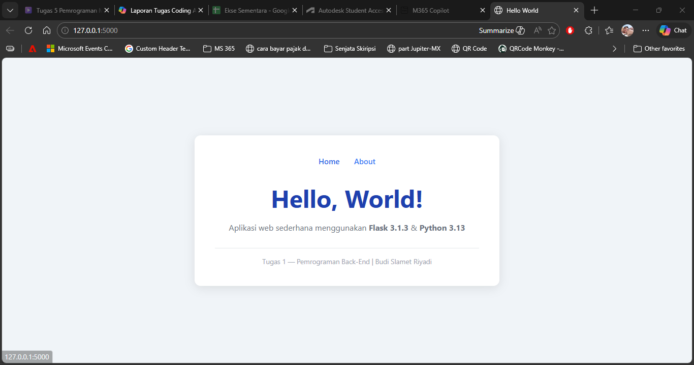

# Tugas 1 — Flask Hello World

## Deskripsi
Aplikasi web sederhana menggunakan Flask yang menampilkan pesan **"Hello, World!"**.

## Teknologi
- Python 3.13.0
- Flask 3.1.3

## Struktur Folder
tugas1-helloworld/
├── static/
│   └── css/
│       └── style.css
├── templates/
│   └── index.html
├── app.py
├── requirements.txt
└── README.md

## screenshot
