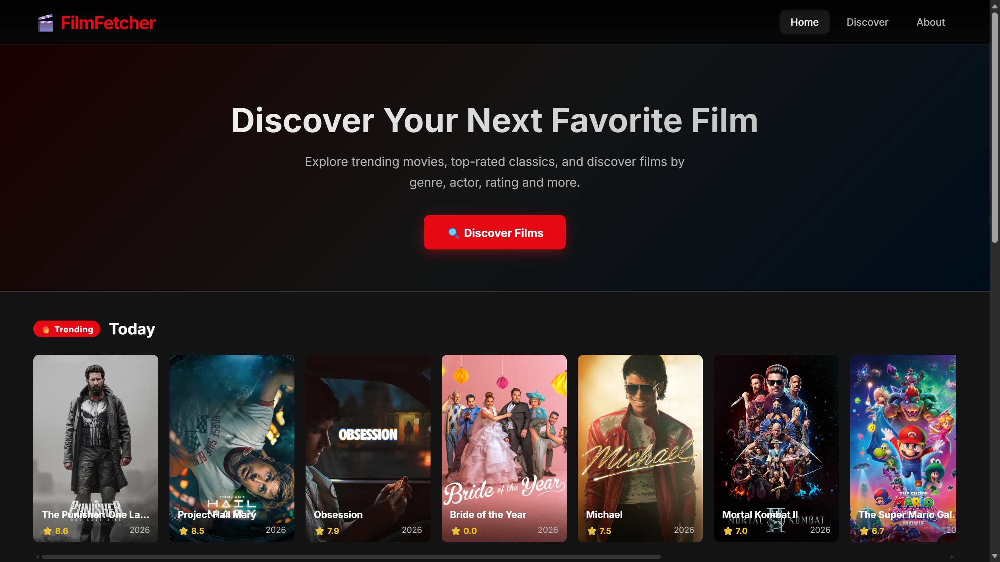
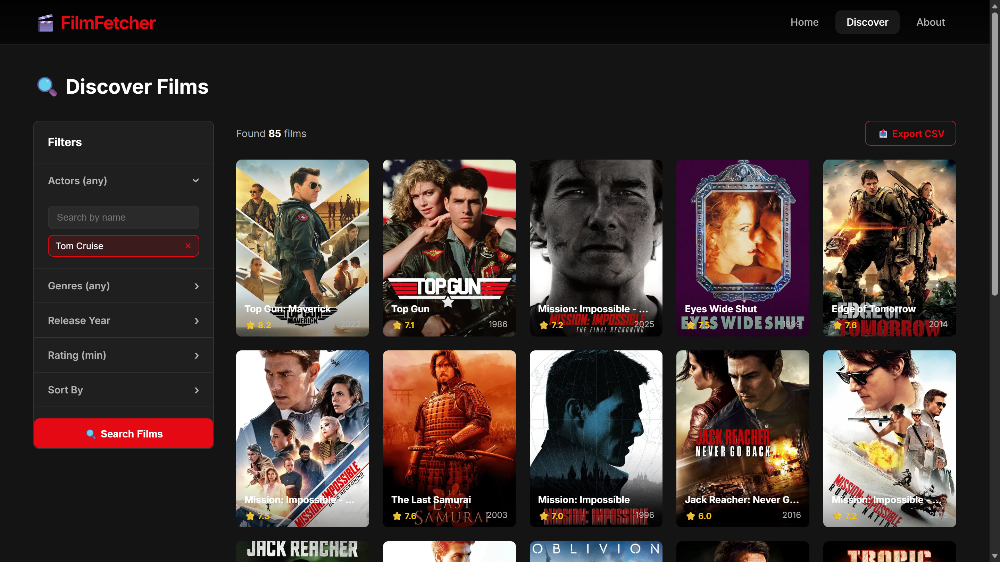
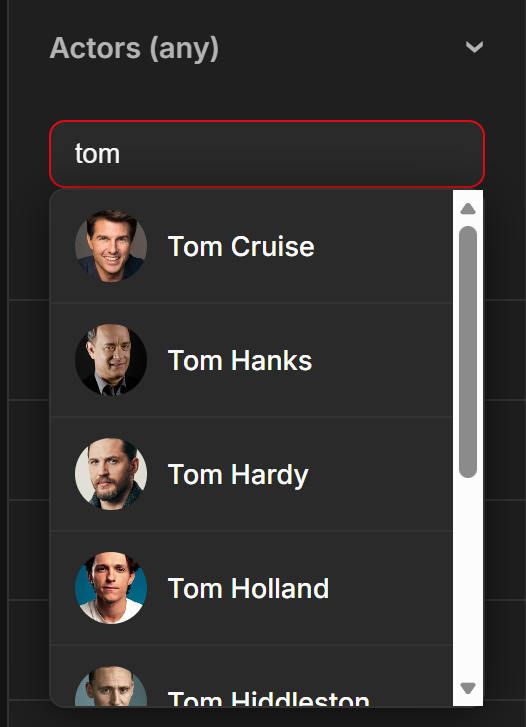
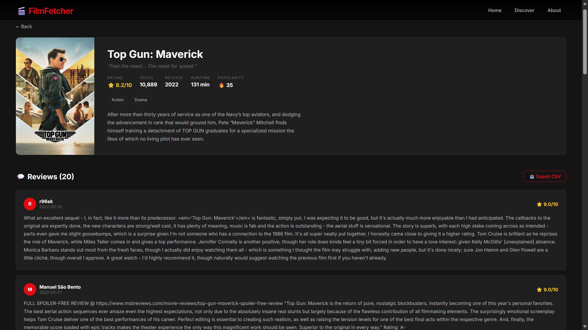
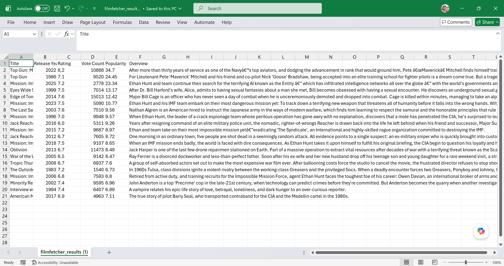
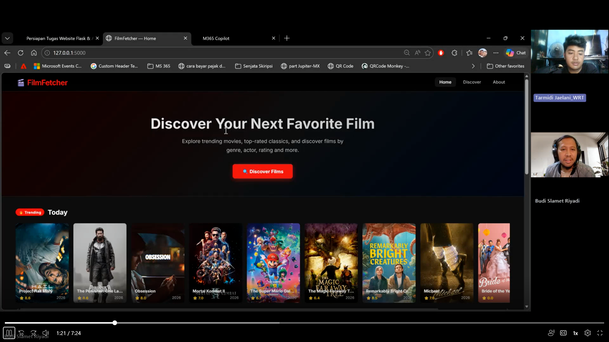

# 🎬 FilmFetcher — Tugas 2 Pemrograman Back-End

## 📌 Deskripsi
FilmFetcher adalah aplikasi web berbasis Flask yang mengambil data film dari **TMDB API** dan menampilkan informasi film secara dinamis seperti trending, popular, dan top-rated movies.

Aplikasi ini mendukung pencarian film dengan filter serta menampilkan review penonton dan export data ke CSV.

---

## 🧠 Tema
Movie Discovery Web App (Integrasi Public API)

---

## 👥 Kelompok 2

| Nama | NIM |
|------|-----|
| Budi Slamet Riyadi | 1003240034 |
| Yedija P | 1003250073 |
| Tarmidi Jaelani | 1003240052 |

---

## ⚙️ Teknologi

- Python 3.13
- Flask 3.1.3
- TMDB API
- HTML, CSS (Dark Mode Netflix Style)
- JavaScript (Fetch API)

---

## 🔑 API

Menggunakan:
👉 https://www.themoviedb.org

Endpoint:
- `/trending/movie/day`
- `/movie/popular`
- `/movie/top_rated`
- `/discover/movie`
- `/search/person`
- `/movie/{id}/reviews`

---

## ✨ Fitur

✅ Home (Trending, Popular, Top Rated)  
✅ Discover Film (Filter)  
✅ Actor Autocomplete (dengan foto)  
✅ Detail Film  
✅ Review Penonton  
✅ Export CSV (delimiter ";")  

---

## 📁 Struktur Project
tugas2-filmfetcher/
│
├── app/
│   ├── routes/
│   ├── services/
│   ├── templates/
│   └── static/
│
├── .env
├── run.py
├── requirements.txt
└── README.md

---

## ▶️ Cara Menjalankan

### 1. Aktifkan Virtual Environment
powershell:
.venv\Scripts\activate
### 2. Install Dependencies
pip install -r requirements.txt
### 3. Jalankan Aplikasi
python run.py
### 4. Buka Browser
http://127.0.0.1:5000

## Screnshot
### Home Page

### Discover Film

### Auto Complete Search & Image Actors

### Detail dan Review Film

### Export File .csv

## 🎥 Demonstration of FilmFetcher Application

Click the image below to watch the presentation:

  

